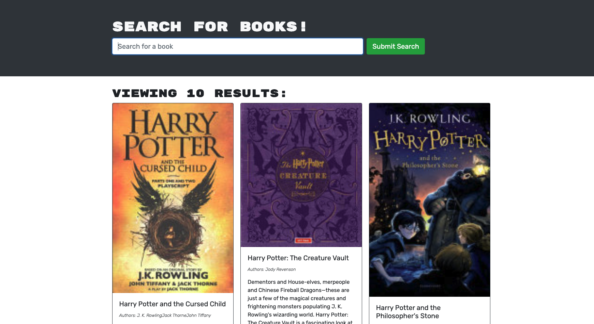

# Mern Book Search
    
## Description
An application that allow users to search for new books to read and save a list of book to purchase.

## Table of Contents
* [Installation](#installation)
* [Screenshot](#screenshot)
* [License](#license)
* [Questions](#questions)

## Installation
Git clone the repository to your local machine. To use application, run the following command: npm install to install necessary dependencies. To start the server locally, run: npm start. Navigate to localhost:3000 in your browser to open the application locally.

## Screenshot

## License
MIT

## Questions
Email: chindatrate@me.com

GitHub: https://github.com/chindatrate